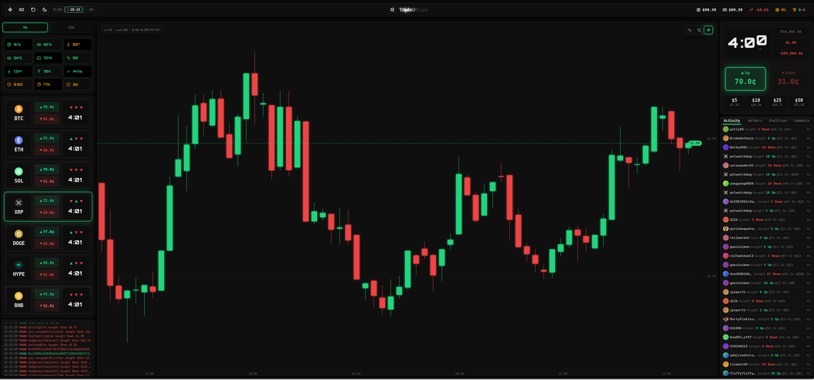

# TripleUCrypt

A real-time crypto **up/down trading terminal** for [Polymarket](https://polymarket.com),
built with Node.js/TypeScript (Express + Vite + React). Live candlestick charts, an order book,
one-click buy/sell, and live positions — across BTC, ETH, SOL, XRP, DOGE, HYPE and BNB
5-minute, 15-minute, 1-hour and 1-day windows.



## What it does

- **Live charts** (custom HTML5 canvas engine, ~60fps requestAnimationFrame) — Line,
  Probability and Candlestick modes, 5m / 15m / 1h / 1d intervals, auto-zoomed to the visible
  range. Candles stream live from Kraken; the forming bar updates every second.
- **All 7 assets** — click any market card to switch the chart and trade panel to that asset.
- **Live markets across four horizons** — every BTC/ETH/SOL/XRP/DOGE/HYPE/BNB up/down window,
  discovered from Polymarket and streamed over the CLOB WebSocket (best ask per side,
  combined, arb badge).
- **Order book** — full depth per side with spread + last price.
- **Trade panel** — size presets, live payout/profit, one-click buy, sell with live P&L on
  open positions.
- **Adaptive performance** — a power manager scales stream/poll intervals to system load.

## Data sources

| Source | Use | Auth |
|--------|-----|------|
| Kraken (REST + WebSocket) | live prices + OHLC candles for all 7 assets | none |
| Polymarket Gamma API | active up/down window discovery | none |
| Polymarket CLOB (REST + WebSocket) | order book, asks, balance, orders | your keys (trading only) |

Market data needs **no credentials**. Credentials are required only to place real trades.

## Modes

- **Practice (default — no `.env`, no wallet):** charts, markets and order book are fully
  live; trades run against a local paper ledger with $100 of play money. Nothing touches a
  real balance. This is where a first run lands.
- **Live:** real, irreversible orders on the Polymarket CLOB via
  [`@polymarket/clob-client-v2`](https://github.com/Polymarket/clob-client). Needs a signer —
  see below; there are three, and they differ mainly in *who holds the key*.

## Setup

Requires **Node.js 22+**.

```bash
git clone https://github.com/TripleU613/TripleUCrypt
cd TripleUCrypt
npm ci
cp .env.example .env        # optional — skip it entirely to start in practice mode
npm run dev                 # frontend :5173 (Vite), backend :8200 (Express)
```

Open <http://localhost:5173>. (Production — `npm run build && npm start` — serves
single-port on <http://localhost:8200> instead; the client talks same-origin, so
there's no separate frontend port to open.)

## Enabling trading

Market data and charts always work with no credentials at all. To place real orders you
pick a **signer**. Three exist; they trade off custody against convenience:

| Signer | Who holds the key | Setup | Per-order UX |
|--------|-------------------|-------|--------------|
| **Browser wallet** *(start here)* | your MetaMask extension | nothing to configure | one signature popup |
| **Generated wallet** | this app, on your machine | one click | instant, no popups |
| **Existing `.env` key** | this app, from a file you write | paste a private key | instant, no popups |

### 1. Browser wallet — recommended for a first run

**No `.env`, nothing to paste, and no key ever reaches this app.** MetaMask signs every
order; the server only relays the signed payload. That means the app *cannot* move your
money without a click you see — which is the right posture for running a stranger's
real-money code.

1. Start the app (Setup, above) and open the **Wallet** panel.
2. Flip **Practice → Live**, set signing to **Browser (wallet)**, and connect MetaMask.
3. Fund the connected address on **Polygon** with **USDC.e**
   (`0x2791bca1…`, the bridged token — *not* native USDC) plus a little **POL** for gas.
4. Your first buy triggers two one-time on-chain approvals; after that it's one signature
   per order.

Worth knowing: this signs as a plain EOA, so it trades from **the connected wallet itself**
— not from the gasless balance inside an existing Polymarket account. Holding native USDC
instead of USDC.e is the usual reason a funded wallet still shows $0; the Wallet panel's
swap card converts it.

### 2. Generated wallet — best for a server / headless deploy

Leave `.env` unset, switch to Live, then **Wallet → Generate trading wallet**. The app
creates a dedicated key, stores it under `~/.triplecrypt` (`trading_wallet.json`, mode
`0600` — or an encrypted keystore if you set a password), and signs **server-side**: no
popups, instant 1-tap orders. Fund the address shown with **USDC on Polygon** plus a little
**POL** for the one-time approval.

This is the only option that works without a browser attached, so it's the one to use on a
VPS. The trade-off is real: the process can sign on its own. Fund it like a burner.

### 3. Existing Polymarket key — for setups that already have one

```bash
POLY_PRIVATE_KEY=0x...       # your Ethereum (Polygon) wallet private key
POLY_WALLET_ADDRESS=0x...    # your Polymarket (proxy/funder) wallet address
```

If present these take **precedence** over a generated wallet, so existing setups are
unchanged. CLOB L2 API credentials are derived from the private key at runtime (the
canonical Polymarket flow) — you never paste `api_key`/`secret`/`passphrase`, and any stored
ones are ignored. `.env.example` documents the optional extras (Polygon RPC override,
deposit history, the gated send feature).

If you're evaluating this repo for the first time, **don't start here** — pasting the key to
a funded account into unfamiliar code is the riskiest of the three. Use option 1.

The app reads secrets **only** from local files (git-ignored, never committed) and passes
the key solely to `@polymarket/clob-client-v2` against `clob.polymarket.com` — it is never
logged or sent to the browser.

## Docker

```bash
cp .env.example .env        # optional — skip for practice mode / browser-wallet signing
docker compose up -d
```

See [DOCKER.md](DOCKER.md) for details.

## Architecture

| Path | Role |
|------|------|
| `src/server/` | Express app (`index.ts`) — SSE state stream, action dispatch, CLOB proxy, SPA fallback |
| `src/engine/` | Server-side state + logic: `state.ts` + `market-data.ts`, `chart.ts`, `windows.ts`, `trading.ts`, `positions.ts`, `order-book.ts`, `social.ts`, `performance.ts`, `wallet.ts` |
| `src/io/` | Data layer — `kraken.ts`, `polymarket.ts` (Gamma/CLOB), `chainlink.ts`, `hindsight.ts` |
| `src/banking/` | Money engine behind one `Broker` interface — `live.ts` (`@polymarket/clob-client-v2`), `paper.ts` + `ledger.ts` (practice), `local-wallet.ts` (generated wallet), `resilience.ts` |
| `client/components/` | UI — nav, chart (canvas engine in `chart/EChart.tsx`), market sidebar, trade panel, order book, wallet panel |
| `client/buses/` | Browser-side wallet bridges — `ClobTrade.ts` (order signing, via the same-origin `/clob`, `/data-api`, `/rpc` proxies), `MetaMaskBus.ts` (injected extension) |
| `client/store.ts` | Zustand client state |
| `client/sse-client.ts` | The browser's only live feed: `/sse` + the liveness watchdog. All market data (prices, book, activity) arrives here — the browser opens no third-party sockets |

See [ROADMAP.md](ROADMAP.md) for the feature checklist.

## Disclaimer

**This software places real, irreversible, on-chain orders with real money.** In live mode it
signs and submits fill-or-kill / limit orders to Polymarket against funds in your wallet.

- **Not financial advice.** Nothing here is a recommendation to trade. You alone are
  responsible for every order placed and every dollar gained or lost.
- **Your keys, your funds.** You supply your own private key via a local, git-ignored `.env`.
  The maintainers never receive it and cannot recover losses. Secure your key and your machine.
- **Jurisdiction.** Polymarket is **geo-restricted and unavailable to users in several
  jurisdictions, including the United States.** You are responsible for complying with
  Polymarket's Terms of Service and the laws that apply to you. Default mode is **practice
  (paper)** — live trading is opt-in and requires credentials.
- **No warranty.** Provided "as is", without warranty of any kind, to the extent permitted by
  the AGPL-3.0 (see sections 15–16). Practice mode is the safe way to evaluate it.

## License

Licensed under the **GNU Affero General Public License v3.0** — see [LICENSE](LICENSE).
In short: you may use, modify, and redistribute it, but if you run a modified version as a
network service, you must make your modified source available to its users under the same
license.

Bundled assets (the Inter typeface, Polymarket marks, coin icons) have their own licenses —
see [assets/LICENSES.md](assets/LICENSES.md).
